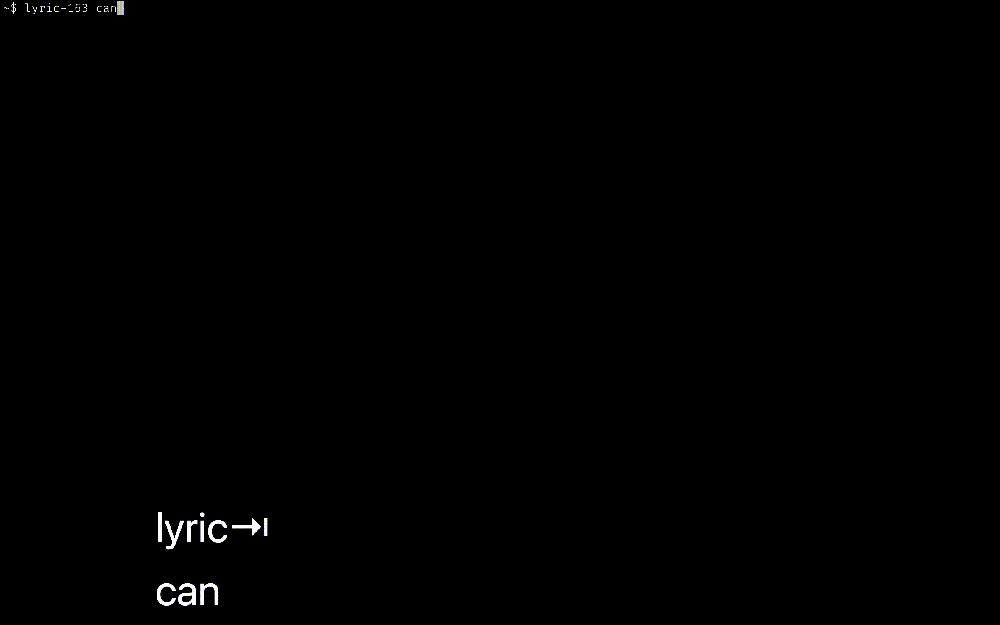

# NetEaseMusic-Lyrics-sh
A shell script to search for and download lyrics from NetEase Music

# Dependencies 

- [jq](https://stedolan.github.io/jq/)

# Usage

```bash
# Download by ID
netease-lyrics.sh 518077128 output.lrc
# Filename defaults to _lyrics.lrc
netease-lyrics.sh 518077128

# Search for lyrics. 
# You will be prompted to examine the lyrics of each song until you decide the one to be saved.
netease-lyrics.sh セカイがカフェになっちゃった
```


